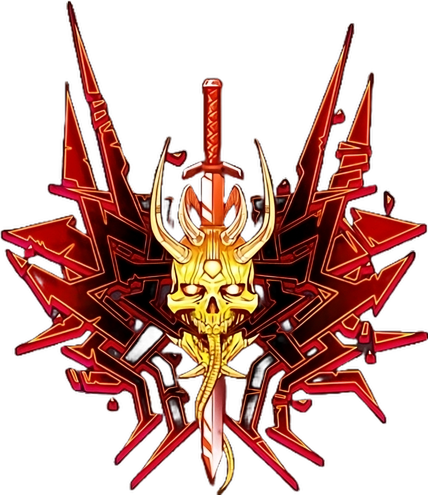

# <a name="manual"></a> BinGo

[](https://github.com/d-code000/BinGo/releases)

<div style="display: flex; align-items: center;">
    
    <div>
        <h2>⚔️ ВОЙНА НАЧИНАЕТСЯ! ⚔️</h2>
        <p>
            Твои враги уже здесь, они ждут, чтобы сразиться с тобой на поле древней мудрости и абсолютной стратегии! Это не просто игра в Го — это твой путь через ад тактических решений.
        </p>
        <p>
            ☠️ Захвати территории или будь уничтожен!<br>
            🔥 Расставь камни — или пусть они падут на твою голову!<br>
            🩸 Каждая ошибка может стать твоей последней!<br>
        </p>
        <p>
            🌌 В этой битве только ты и твой разум.<br>
            Сломай границы, разорви цепи сомнений, стань Властелином доски!
        </p>
    </div>
</div>


# Engine

## KataGo

GitHub: https://github.com/lightvector/KataGo  
Release: https://github.com/lightvector/KataGo/releases/tag/v1.15.3  
Network: https://katagotraining.org/networks/

About human-like model: https://github.com/lightvector/KataGo/releases/tag/v1.15.0#:~:text=New%20Human%2Dtrained%20Model

### Install
This build for Windows

KataGo v1.15.3 with TensorRT 10.2.0 and CUDA 12.5 for Windows x64 (Nvidia GPU)
```powershell
curl.exe -L -o katago.zip "https://github.com/lightvector/KataGo/releases/download/v1.15.3/katago-v1.15.3-trt10.2.0-cuda12.5-windows-x64.zip"
```
KataGo v1.15.3 with OpenCL for Windows x64 (CPU only)
```powershell
curl.exe -L -o katago.zip "https://github.com/lightvector/KataGo/releases/download/v1.15.3/katago-v1.15.3-opencl-windows-x64.zip"
```
```powershell
mkdir katago
Expand-Archive -Path katago.zip -DestinationPath katago/source
mkdir katago/source/models
```
Main model
```powershell
curl.exe --output-dir katago/source/models/ -L -O "https://media.katagotraining.org/uploaded/networks/models/kata1/kata1-b28c512nbt-s7944987392-d4526094999.bin.gz"
```
Human-like model
```powershell
curl.exe --output-dir katago/source/models/ -L -O "https://github.com/lightvector/KataGo/releases/download/v1.15.0/b18c384nbt-humanv0.bin.gz"
```

### Benchmark

```powershell
katago/source/katago.exe benchmark -model katago/source/models/kata1-b28c512nbt-s7944987392-d4526094999.bin.gz
```